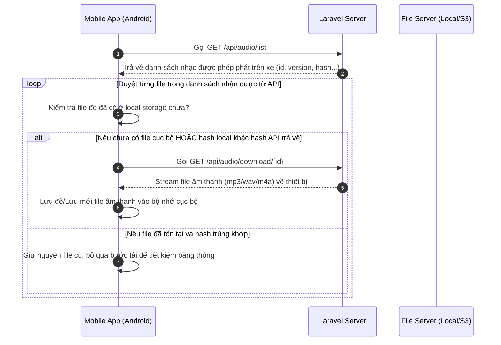
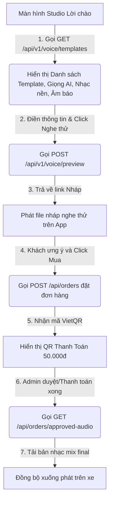

# HƯỚNG DẪN TÍCH HỢP REST API HỆ THỐNG HI CAR

> Phiên bản API: `V1.1.0`  
> Base URL Production: `https://admintts.kingcong.shop`  
> Định dạng truyền nhận: `application/json` (Bắt buộc gửi kèm `Accept: application/json` ở mọi Request)

---

## 1. 🔑 Quy chuẩn Xác thực & Quản lý Thiết bị (Authentication)

Mọi API (trừ luồng đăng nhập công khai) đều yêu cầu đính kèm Token trong Header dưới dạng **Bearer Token**:

```http
Authorization: Bearer <your_access_token>
Accept: application/json
```

### 🔴 Quy tắc "1 Tài khoản = 1 Thiết bị tại 1 thời điểm"

- **Cơ chế:** Khi tài xế đăng nhập trên thiết bị mới (bằng Mã kích hoạt hoặc Số điện thoại), hệ thống sẽ **tự động thu hồi (revoke) toàn bộ token cũ** trên các thiết bị trước đó để đảm bảo an toàn thông tin và chống trộm tài khoản.
- **Xử lý phía App:** Nếu bất kỳ API nào trả về mã lỗi **`401 Unauthorized`**, App phải tự động xóa sạch token cục bộ, đăng xuất người dùng lập tức và chuyển tài xế về màn hình đăng nhập.

---

## 2. 🔀 Các API Đăng nhập & Chọn Xe hoạt động

### 2.1 Đăng nhập bằng Mã Kích Hoạt (B2B / Bán lẻ)

- **Endpoint:** `POST /api/auth/login`
- **Request Body (`application/json`):**
  ```json
  {
    "code": "HC8888",
    "device_id": "9774d56d682e549c",
    "device_name": "Xiaomi Box 4K",
    "device_model": "MDZ-22-AB",
    "os_version": "Android 9.0",
    "app_version": "v1.0.2"
  }
  ```
- **Response Thành công (`200 OK`):**
  ```json
  {
    "status": "success",
    "message": "Đăng nhập thành công",
    "data": {
      "token": "1|abcdef123456...",
      "driver": {
        "id": 5,
        "name": "Nguyễn Văn A",
        "phone": "0987654321",
        "active_vehicle_id": 12,
        "active_vehicle_plate": "30F-123.45"
      },
      "bus_company": { "name": "Nhà Xe Việt Nam" },
      "license": { "expires_at": "Vĩnh viễn" }
    }
  }
  ```

### 2.2 Đăng nhập bằng Số Điện Thoại & Mật Khẩu (Tài xế)

- **Endpoint:** `POST /api/auth/login/phone`
- **Request Body (`application/json`):** Gửi kèm `"phone"`, `"password"`, `"device_id"`, `"device_name"`, `"device_model"`, `"os_version"`, `"app_version"`.

### 2.3 Chọn xe vận hành (Bắt buộc gán xe hoạt động)

One tài xế có thể được gán lái nhiều xe khác nhau trong đội xe của Nhà xe (B2B) hoặc chỉ sở hữu duy nhất 1 xe mặc định (B2C). Do đó, luồng xử lý thông minh dưới App cần tuân thủ quy tắc sau:

- **API Lấy danh sách xe khả dụng:** `GET /api/vehicles`
- **API Chọn xe vận hành:** `POST /api/vehicles/select` _(Request Body: `{"vehicle_id": 12}`)_

> [!TIP]
> **💡 Logic xử lý thông minh giúp tối ưu trải nghiệm (UX):**
>
> 1. Sau khi gọi `GET /api/vehicles`, nếu mảng dữ liệu trả về **chỉ có duy nhất 1 xe**, App **KHÔNG CẦN** hiển thị giao diện chọn xe mà hãy tự động lấy `id` của xe đó, gọi ngầm API chọn xe `/api/vehicles/select` và đưa tài xế thẳng vào Trang chủ để phát nhạc.
> 2. Chỉ khi danh sách trả về **từ 2 xe trở lên** (tài xế nhà xe B2B lớn thay ca lái nhiều xe), App mới hiển thị màn hình danh sách xe để tài xế tự chọn xe đang lái hôm nay.

### 2.4 Kiểm tra phiên đăng nhập (Me)

- **Endpoint:** `GET /api/auth/me` _(Yêu cầu Bearer Token)_
- **Mục đích:** App gọi khi khởi động để xác minh token còn hiệu lực (tài khoản chưa bị xóa/vô hiệu trên hệ thống).
- **Response Thành công (`200 OK`):**
  ```json
  {
    "status": "success",
    "data": {
      "id": 1,
      "name": "Nguyễn Văn A",
      "phone": "0987654321",
      "email": "user@example.com",
      "is_active": true,
      "avatar": null,
      "last_login_at": "2019-08-24T14:15:22Z",
      "created_at": "2019-08-24T14:15:22Z",
      "updated_at": "2019-08-24T14:15:22Z"
    }
  }
  ```
- **Xử lý phía App:**
  - `401` / `403` / `404` → huỷ phiên cục bộ, chuyển màn đăng nhập.
  - `200` với `is_active: false` → coi phiên không hợp lệ, đăng xuất.
  - Mất mạng lúc kiểm tra → cho phép vào app với dữ liệu cache (retry ở lần sync/resume sau).

---

## 3. 🔄 Quy trình Đồng bộ Nhạc Offline

> [!IMPORTANT]
> **Quy tắc bắt buộc:** App **KHÔNG ĐƯỢC** phát nhạc bằng cách stream trực tiếp qua Internet để tránh gián đoạn/mất tiếng khi xe đi qua vùng sóng yếu. App bắt buộc phải đồng bộ tải file về bộ nhớ máy (`Local Storage`) và phát offline cục bộ.

### 🎬 Sơ đồ tuần tự các bước đồng bộ (Sequence Workflow):



### 3.1 Lấy danh sách Audio được gán cho Xe

- **Endpoint:** `GET /api/audio/list` _(Yêu cầu Bearer Token)_
- **Response:** Trả về danh sách nhạc, bao gồm `id`, `title`, `type` (`greeting` hoặc `farewell`), `url` tải trực tiếp, `version`, `file_size`, và đặc biệt là `hash` (mã md5 của file dùng để so sánh thay đổi).

### 3.2 Tải Audio Offline

- **Endpoint:** `GET /api/audio/download/{id}` _(Yêu cầu Bearer Token)_
- **Response:** Stream nhị phân của tệp tin âm thanh (hỗ trợ `mp3`, `wav`, `m4a`). App cần ghi trực tiếp stream này thành file local.

---

## 4. 🎙️ Luồng Tự Tạo Lời Chào Cá Nhân (Self-Service Voice Studio)

Hệ thống cho phép khách hàng hoặc tài xế tự thiết kế câu chào, chọn giọng AI đọc, trộn nhạc nền tự động ngay trên điện thoại của mình.

### 🎬 Giao diện di động tích hợp:



### 4.1 Lấy danh sách Mẫu, Giọng đọc & Nhạc nền

- **Endpoint:** `GET /api/v1/voice/templates` _(Yêu cầu Bearer Token)_
- **Response:** Trả về các mảng `templates` (chứa các biến `{tên_kh}`, `{biển_số_xe}`, `{dòng_xe}`), `voice_samples`, `background_musics`, `signal_sounds` và thông tin xe hiện tại `current_vehicle` để hỗ trợ điền nhanh thông tin vào form nhập liệu.

### 4.2 Tạo Bản Nghe Thử Nháp (Preview Audio)

- **Endpoint:** `POST /api/v1/voice/preview` _(Yêu cầu Bearer Token)_
- **Cơ chế bảo vệ (Rate Limit):** Khách hàng tự tạo qua app chỉ được tạo tối đa **3 lần/ngày** trên mỗi thiết bị/tài khoản để chống spam và phá hoại tài nguyên server. Vượt quá sẽ trả về lỗi `403 Forbidden` kèm message tiếng Việt cảnh báo.
- **Request Body:**
  ```json
  {
    "customer_name": "Hải Đăng",
    "plate_number": "30K88888",
    "vehicle_model": "Limousine",
    "voice_template_id": "sang_trong",
    "voice_sample_id": 1,
    "background_music_id": 3,
    "signal_sound_id": 1,
    "bg1_volume": 0.6,
    "bg2_volume": 0.2,
    "voice_speed": 1.0,
    "voice_delay": 1.5
  }
  ```
- **Response Thành công (`200 OK`):**
  ```json
  {
    "success": true,
    "message": "Tạo bản nghe thử thành công",
    "data": {
      "preview_url": "https://admintts.kingcong.shop/storage/temp/preview_abcdef123.mp3",
      "content_used": "Kính chào ông chủ Hải Đăng và đại gia đình... số hiệu Ba Mươi Kờ - Tám Tám Tám - Tám Tám..."
    }
  }
  ```
  > [!NOTE]
  > **Lưu ý cực kỳ quan trọng cho Dev:** File `.mp3` trả về ở link `preview_url` **ĐÃ ĐƯỢC SERVER TRỘN SẴN nhạc nền, âm báo hiệu, điều chỉnh tốc độ đọc và âm lượng** đúng theo các tham số cấu hình gửi lên thông qua công cụ FFmpeg trên máy chủ. App chỉ việc phát link này trực tiếp cho người dùng nghe thử, tuyệt đối không cần viết code trộn nhạc dưới local.

### 4.3 Đặt mua (Tạo Đơn Hàng)

- **Endpoint:** `POST /api/v1/orders` _(Yêu cầu Bearer Token)_
- **Request Body:** Truyền các tham số cấu hình tương tự như khi Preview kèm theo `"draft_audio_url"` nhận được từ API Preview.
- **Response Thành công (`200 OK`):** Trả về `order_id`, `order_code` và đặc biệt là `payment_qr_url` (Link ảnh QR VietQR 50.000đ điền sẵn số tiền và nội dung chuyển khoản chính là mã đơn hàng).

### 4.4 Sửa & Tạo lại miễn phí trong 24 giờ

- **Quy tắc:** Cho phép khách hàng sửa đổi thông tin lời chào hoàn toàn miễn phí nếu thực hiện trong vòng 24 giờ kể từ thời điểm tạo đơn hàng ban đầu. Quá 24h sẽ bị tính phí 55.000đ.
- **Endpoint:** `POST /api/v1/orders/{order_id}/recreate` _(Yêu cầu Bearer Token)_
- **Request Body:** Toàn bộ payload tham số cấu hình chỉnh sửa mới.
- **Response nếu quá 24h (`403 Forbidden`):**
  ```json
  {
    "success": false,
    "message": "Đã quá 24h kể từ lúc tạo đơn. Việc tạo lại sẽ mất phí 55.000đ. Vui lòng liên hệ tổng đài để thanh toán và tạo lại."
  }
  ```

---

### 💡 Các tham số cấu hình mix nhạc nâng cao (Đã đồng bộ giá trị mặc định của Server):

Khi gọi API Đặt hàng (`POST /api/v1/orders`), Nghe thử (`POST /api/v1/voice/preview`), hoặc Tạo lại (`recreate`), App có thể truyền các tham số sau để tùy biến âm lượng và hiệu ứng nhạc nền:

| Tham số               | Kiểu dữ liệu        | Giá trị mặc định | Mô tả                                                |
| :-------------------- | :------------------ | :--------------- | :--------------------------------------------------- |
| `background_music_id` | Integer             | `null`           | ID bản nhạc nền được chọn (lấy từ API templates)     |
| `signal_sound_id`     | Integer             | `null`           | ID âm báo phát trước khi bắt đầu đọc lời chào        |
| `bg1_volume`          | Float (0.0 -> 1.0)  | `0.5`            | Âm lượng của nhạc nền 1                              |
| `bg2_volume`          | Float (0.0 -> 1.0)  | `0.15`           | Âm lượng của nhạc nền 2 (nếu có)                     |
| `voice_speed`         | Float (0.5 -> 2.0)  | `1.0`            | Tốc độ đọc của giọng nói (1.0 là bình thường)        |
| `voice_delay`         | Float (0.0 -> 10.0) | `2.0`            | Độ trễ (giây) giữa âm báo hiệu và giọng đọc lời chào |

---

## 5. 🐞 API Đẩy Log Lỗi từ App lên Server (Error Logger)

Để hỗ trợ theo dõi từ xa trạng thái của App chạy trên màn hình Android Box hoặc Máy tính bảng đặt trên cabin, App di động **bắt buộc** phải bọc các hàm phát nhạc, ghi đè file, lỗi kết nối Bluetooth vào khối `try-catch` và gửi báo cáo về server.

- **Endpoint:** `POST /api/logs/error` _(Yêu cầu Bearer Token)_
- **Request Body (Bắt buộc tuân thủ đúng validation):**

  ```json
  {
    "error_type": "bluetooth",
    "description": "Lỗi ngắt kết nối Bluetooth đột ngột khi đang chuẩn bị phát file chao_xe_01.mp3",
    "device_id": "9774d56d682e549c",
    "device_name": "Xiaomi Box 4K",
    "device_model": "MDZ-22-AB",
    "os_version": "Android 9.0",
    "app_version": "v1.2.0",
    "sync_status": "synced"
  }
  ```

  > [!IMPORTANT]
  > **Lưu ý nghiệp vụ:** Trường `error_type` bắt buộc phải là một trong các giá trị sau: `bluetooth`, `audio`, `sync`, `permission`, `other` (viết thường). Gửi bất kỳ giá trị nào khác sẽ bị máy chủ từ chối với mã lỗi `422 Unprocessable Entity`.

- **Response Thành công (`201 Created`):**
  ```json
  {
    "success": true,
    "message": "Đã ghi nhận log lỗi. Cảm ơn bạn đã báo cáo.",
    "data": {
      "id": 142
    }
  }
  ```

---

## 6. 💡 Gợi ý Kỹ thuật cho Lập trình viên di động (Android / Flutter)

1.  **Lắng nghe sự kiện (Triggers) để phát nhạc:**
    - Lắng nghe trạng thái nguồn sạc (để phát hiện xe bắt đầu nổ máy/cắm tẩu thuốc).
    - Lắng nghe kết nối Bluetooth (khi điện thoại bắt cặp thành công với đầu đĩa Bluetooth xe).
    - Vẽ nút nổi (Floating Button/Overlay) đè lên giao diện khác để tài xế bấm Chào/Tạm biệt thủ công khi cần.
2.  **Cài đặt Delay Phát nhạc:**
    - Nên thiết lập một hàm `sleep()` hoặc `Delay` khoảng 1000ms - 2000ms (cấu hình được trên giao diện cài đặt của app) từ lúc nhận sự kiện phát nhạc đến khi lệnh phát thực sự chạy, giúp tránh việc đầu đĩa Bluetooth nuốt mất âm thanh trong 1-2 giây đầu kết nối.
3.  **Trạng thái Chạy Ngầm rõ ràng (Foreground Service):**
    - Tạo một thông báo cố định ở thanh trạng thái (Persistent Notification) hiển thị: **"Hi Car đang sẵn sàng chào khách"** kèm trạng thái kết nối Bluetooth để hệ điều hành Android không tự động tắt app.
